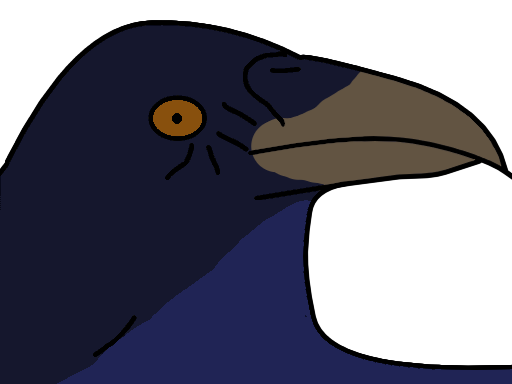

# corvus

A basic visual file explorer built on [bevy](https://www.bevy.org) and [cobweb-ui](https://github.com/UkoeHB/bevy_cobweb_ui).

<!--toc:start-->

- [corvus](#corvus)
  - [Features](#features)

<!--toc:end-->

## Features

Application:

- [ ] open at path
  - [x] open at current working directory
- [ ] multiple windows

Styling:

- [ ] themes or colorizing
- [ ] a design direction

Explorer:

- [ ] preview file content
  - [x] text
  - [x] images
  - [ ] binary
- [ ] drag-and-drop files onto the app
- [ ] drag-and-drop files from the app

Navigation:

- [ ] editable address bar
  - [ ] selectable text
- [ ] go home button
- [x] reload button
- [x] navigation history
  - [x] go back button
  - [x] go forward button
  - [ ] see history

Bookmarks:

- [ ] add bookmark button
- [ ] bookmarks list
  - [ ] on bookmarks tab

Layout

- [ ] draggable pane separator (to resize)
